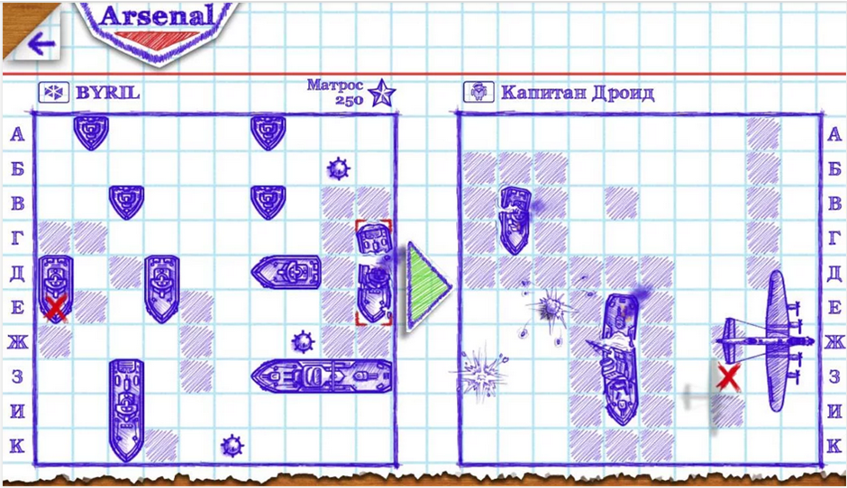
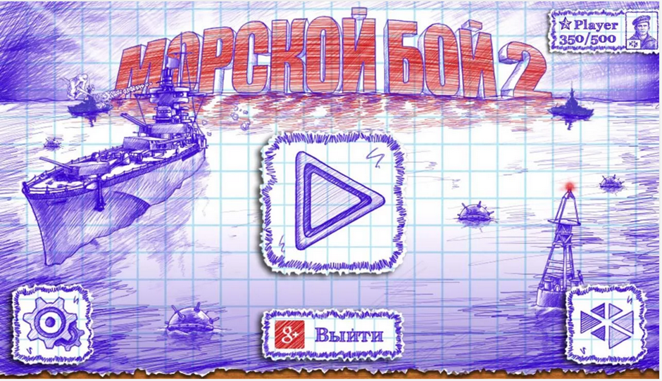
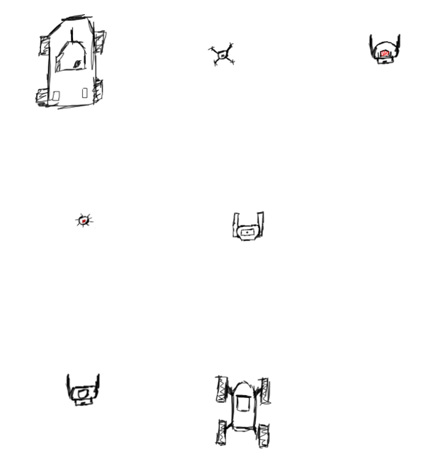
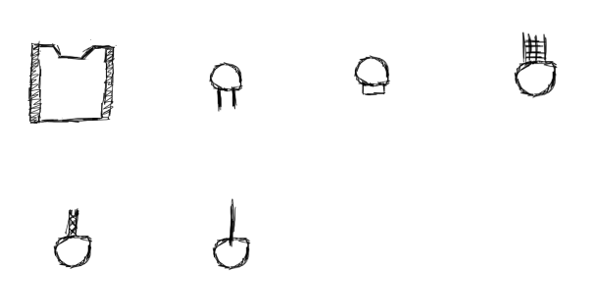
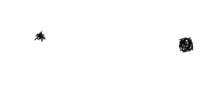
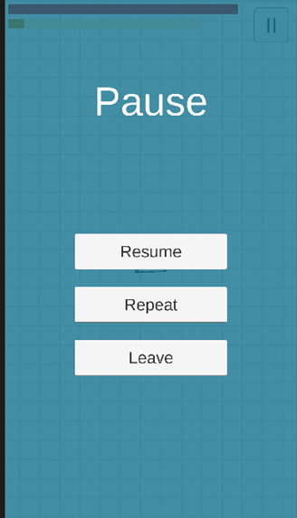
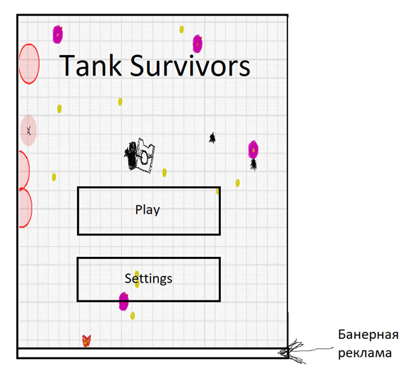
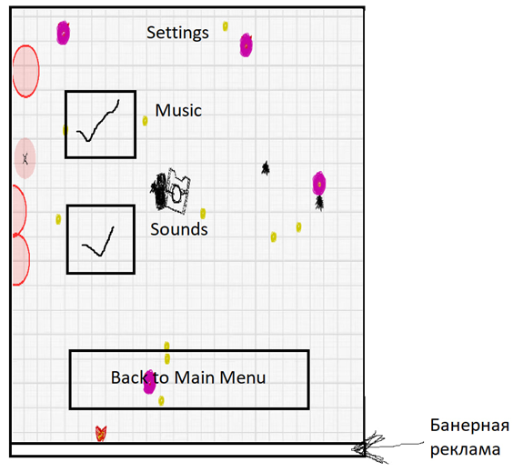
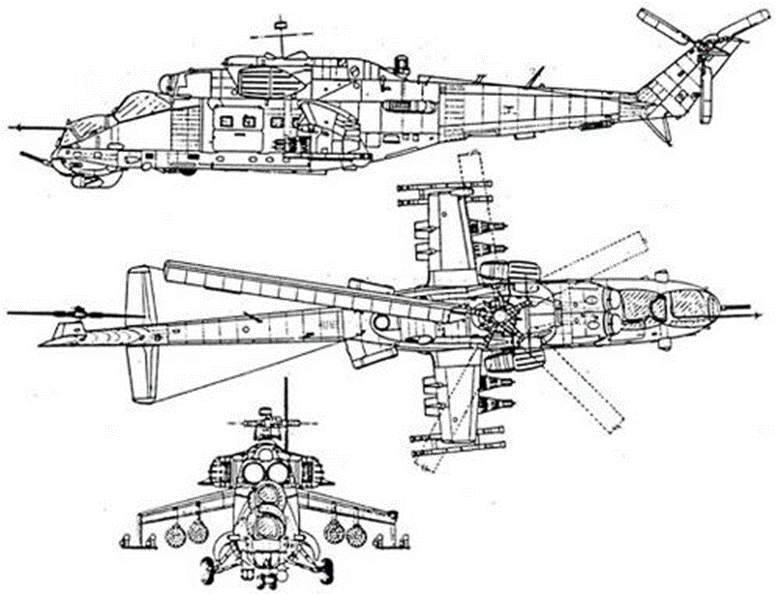

# Тех задание на арт для игры Tank Survivors – мобильная 2D игра в жанре shoot em up. 

## 1. Описание сеттинга и идеи игры

Сеттингом игры является современность. Стиль игры – иллюстрации в тетрадке. Игрок управляет танком, уничтожая вражескую технику и пытаясь выжить
В качестве референсов взята графика из игры Морской бой 2.

Рисунок 1.1 – Референс визуального стиля

Рисунок 1.2 – Референс визуального стиля

Рисунок 1.3 – Референс визуального стиля

 

## 2.	Готовые концепты

Данные арты используются в качестве рабочих. Врагами выступают перечисленные объекты: техника, роботы солдаты, дроны, мины. Данные враги не имеют анимаций, двигаются в сторону игрока сохраняя свой внешний вид.

Рисунок 2.1 – Концепты врагов

Главный герой – танковая основа, на которой размещаются различные башни (одиночная, рельсовая, двойная, пулемётная, миномётная). У игрока всё время одна танковая основа, а башни меняются и вращаются.

Рисунок 2.2 – Концепты танковой основы, башен и собранного танка

Башни игрока выстреливают разными типами снарядов: обычные и взрывные. У разных типов снарядов отличающийся внешний вид.

Рисунок 2.3 – Концепты снарядов

Подбираемые объекты – здоровье и опыт, выпадающие после убийства врагов. Скопления маленьких частиц опыта объединяются в большие частицы, отличающиеся не только размером, но и цветом. 

Рисунок 2.4 – Концепты подбираемых объектов

Далее приведены концепты UI, используемых в меню.

 

Рисунок 2.5 – Концепты главного меню и меню паузы

## 3.	Функциональные описания и референсы
Перечень элементов, необходимых к реализации, с их описанием:
-	Главное меню – кнопки “играть” и “настройки”. На заднем фоне должен быть скриншот из игры. В верхней части название игры.

Рисунок 3.1 – Главное меню

-	Меню настроек – название меню сверху, две кнопки с переключением “звук” и “музыка”. Кнопка снизу – вернутся в главное меню. Задний фон такой же как в главном меню только затемнённый (процентов на 30-50%). 

Рисунок 3.2 – Меню настроек

-	Меню выбора уровня – название меню вверху, кнопка “назад” сверху слева в виде стрелочки возвращает в главное меню. Квадраты с цифрами – уровни. В этих квадратах должны быть звёзды, которые загораются. Задний фон такой же как в главном меню только затемнённый. (процентов на 30-50%).

Рисунок 3.3 – Меню уровней

-	Экран победы – надпись что игрок выжил/победил. Прямоугольник по центру экрана, занимающее большую его часть, с информацией о том, как игрок прошёл уровень (количество убитых врагов, улучшений, нанесённого урона). В этом прямоугольнике – кнопка “вернуться в меню выбора уровня”.  Задний фон - игра ставится на паузу и затемняется (процентов на 30-50%).   

Рисунок 3.4 – Экран победы

-	Экран проигрыша - надпись вверху экрана “вы проиграли”. Две кнопки “начать уровень заново” и “выйти в главное меню”. Задний фон - игра ставится на паузу и затемняется. (процентов на 30-50%).

-	Меню паузы – нужны кнопки “продолжить”, “начать уровень заново” и “выйти в меню выбора уровня”. Также необходимы кнопки включения\выключения звука\музыки в игре.  Надпись пауза по центру вверху экрана. 

-	Экран прокачки персонажа – надпись “уровень повышен”.  

Пример главного героя – ориентироваться необходимо на данный арт. В таком стиле нужны все башни, танковая основа, враги. 

Рисунок 3.5 - Пример нового визуального стиля

Описание босса-вертолёта (идея на будущую реализацию - сейчас делать не надо) 

Рисунок 3.6 - Референс босса-вертолёта
 
Босс-вертолёт: Модель должна быть нарисована с видом сверху, как если бы мы смотрели на вертолёт сверху. Босс-вертолёт должен быть большого размера, чтобы его можно было легко узнать и выделить на экране. Детали вертолёта включают:

Фюзеляж: подробно проработанный фюзеляж с окнами, дверьми, двигателями и другими характерными деталями.

Лопасти: Видимые и детализированные лопасти, возможно, крупные и мощные.

Пули: Пулемёты или пушки, из которых вертолёт стреляет пулями. Пули могут быть маленькими металлическими точками.

Ракеты: Ракеты, выпускаемые вертолётом, возможно, на подвесках под фюзеляжем.

Другие детали: Антенны, лампы, маркировки и любые другие характерные элементы вертолёта.

4. Конкретное задание

Перерисовать всех врагов:
-   Дрон
-	Робот
-	Солдат
-	Мина
-	БМП
-	Грузовик
-	Элитный солдат

Перерисовать пик апы:

-	Опыт
-	Большой опыт
-	Здоровье

Перерисовать главного героя:

-	Танковая основа
-	Обычная башня
-	Пулемётная башня
-	Гранатомётная башня
-	Двух пушечная башня ( нужна башня с пушкой вместе, также отдельный спрайт пушки)
-	Рельсотронная башня ( нужна башня с пушкой вместе, также отдельный спрайт пушки)

Перерисовать снаряды:

-	Пуля
-	Граната

Перерисовать меню:

-	Главное 
-	Пауза
-	Экран прокачки

Нарисовать меню:

-	Настройки
-	Выбор уровня
-	Победа
-	Поражение
