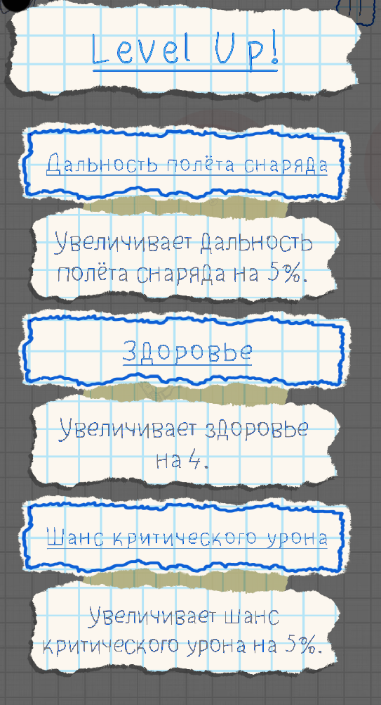
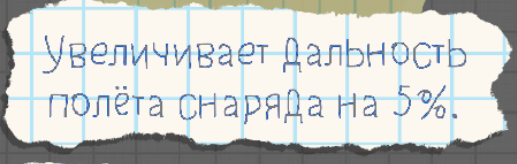

# Что фиксить в UI?

Заметка от 02.05.2024
<h1> Меню апдейта</h1>
На основе тестов у рандомных людей была выявлена следущая тенденция - люди хотят нажимать на текст обведённый в рамке. Понимаю это желание даже со стороны логики - оно выделено рамкой синего цвета. Надо это исправить. 

 

<h2>Как фиксить?</h2>

Необходимо объединить название апдейта и его описание в 1 кликабельный объект. 

Задний фон и текст описания конкретного объекта необходимо уменьшить.

<h1> Камера</h1>

Камеру надо установить на дальность 9. 

<h1> Кнопка паузы</h1>

Кнопка паузы не работает - просто не жмётся.  