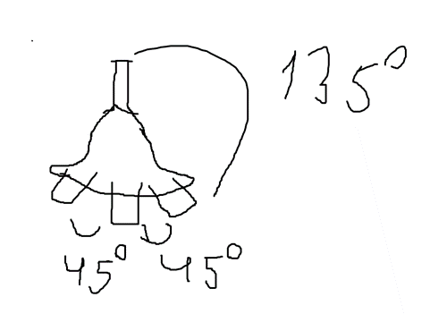

# Подробное описание ганов:

## Дабл Ган

1.	Только появилась. У башни появляется 2 пушки, которые стреляют по очереди самонаводкой во врагов обычными пулями.
2.	Эволюция 1. У башни сзади по центру появляется ещё 1 пушка, которая стреляет со скоростью атаки: 75% от основной. Стреляет в обратном направлении от основной, не наводится на врагов.
3.	Эволюция 2. У башни слева и справа появляется по пушке. Стреляют скоростью атаки: 75% процентов от основной, не наводится на врагов. 

## Рейл Ган

1.	Только появилось. Стреляет лучом. Луч вылетает из дула и исчезает. (То как работает сейчас.)
2.	Эволюция 1. Луч приклеен к пушке. Получается что-то вроде меча. Наносит урон быстро, но мало. Чем дольше, живёт тем больше урона. Есть перезарядка выпуска луча, время тика урона луча, урон от луча.
3.	Эволюция 2. Создаёт 3 ствола. Они стреляют лучом, как в первом варианте. Стволы расположены на определённом угле поворота от основной пушки башни. Угол можно настраивать.

 
## Гранатомёт

1.	Только появился. Башня начинает стрелять гранатами. Стреляет 1 гранатой. Направлена во врага. Гранаты взрывается в определённом радиусе. Гранаты наносят определённый урон. 
2.	Эволюция 1. Вокруг танка происходит взрыв в заданном радиусе. Взрыв происходит через определённое время и наносит определённый урон.
3.	Эволюция 2. Гранаты начинают гореть после взрыва. Радиус взрыва превращается в радиус горения. Горит область определённое количество времени, наносит определённый урон с определённой скоростью атаки.

## Пулемёт
1.	Только появилось. У башни 1 пушка. Стреляет спреем в небольшом радиусе. Стреляет маленькими снарядами.
2.	Эволюция 2. Спрей становится шире.
3.  Эволюция 3. Маленькие снаряды заменяются на обычные
