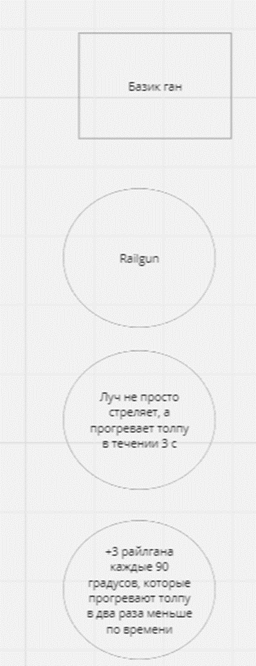
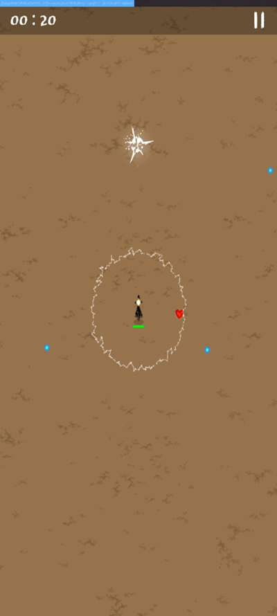

# Общие вижен игры

## Система установки башен:

Игрок стартует с обычной башней (как это есть сейчас)

Надо сделать систему, в которой через n уровней открывается специальное меню для улучшения башни. Там 4 башни на выбор: double gun, railgun, grenade launcher, Minigun. 

Как оно должно выглядеть: 

Скипнуть апгрейд нельзя. Когда игрок выбирает одну из этих пушек, он продолжает играть. Через n уровней он автоматически получает эволюцию этой пушки. Затем ещё раз. Всего получается три эволюции. Количество уровней для того чтобы появились этапы эволюции надо вынести в конфиг, чтобы я мог настроить и потестить. Засуньте в LevelProgress .
 
Пример всей ветки эволюции.

 
 
 
 

## Прокачка:

В ходе всей игры игроку доступна прокачка. Будет 2 пула для прокачки: пул для обычных статов и пул для прокачки конкретной башни. Наполнение этих пулов оставьте мне. Насколько я видел это уже реализовано. При повышении уровня появляется 3 апгрейда на выбор. 2 из одного пула и 1 из другого. Появление апдейтов рандомно. Пулы бесконечны.

 
 
 
 

## Цель игры:

В игре будут уровни. Каждый уровень – это локация разной стилистики в сеттинге тетрадей и школьной фигни(учебники, тетради, канцелярия и тд). Чтобы пройти уровень надо прожить на нём 15 минут. Каждые 5 минут будет спавнится босс. Когда спавнится босс, остальные мобы прекращают спавн, пока босс не будет убит. 

(Пока нет нарисованных локаций и боссов делаем так – будет 1 локация, в качестве боссов выступят рядовые враги с большим количество здоровья.)

Система с боссом должна быть отдельным конфигом чтобы взять префаб любого врага и сделать его боссом, тут же должны быть настройки характеристик босса.

- Босс на 5 минут – префаб 1 
- Босс на 10 минут – префаб 2 
- Босс на 15 минут – префаб 3 

Надо добавить таймер, видимый игроку. Сделаем как magic survival. Уровень здоровья надо приклеить к танку. Шкала опыта в самом верху экрана. Таймер слева вверху, пауза справа вверху.
 

 
 
 
 

## Локализация

Игру надо перевести на русский тк выкладываем на яндекс игры. Там аудитория не знает английского, и платформа скорее всего на английском не пустит.

 
 
 
 

## Музыка

В игру надо добавить задний саундтрек на фон, а также снабдить выстрелы и врагов своим звуком сопровождением. Как идея - озвучить самим, всё в стиле школьной тетрадки.
