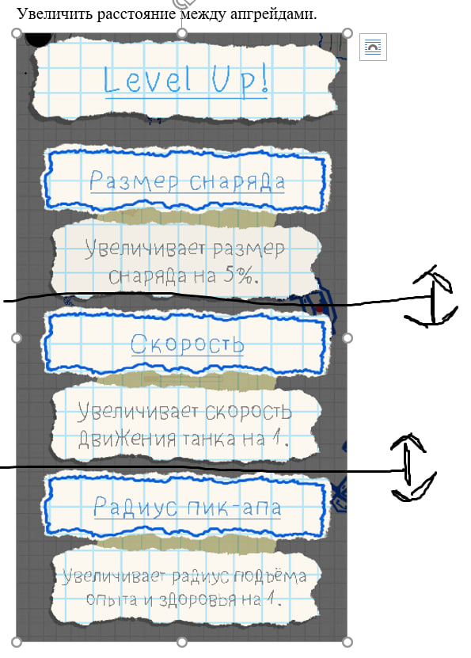
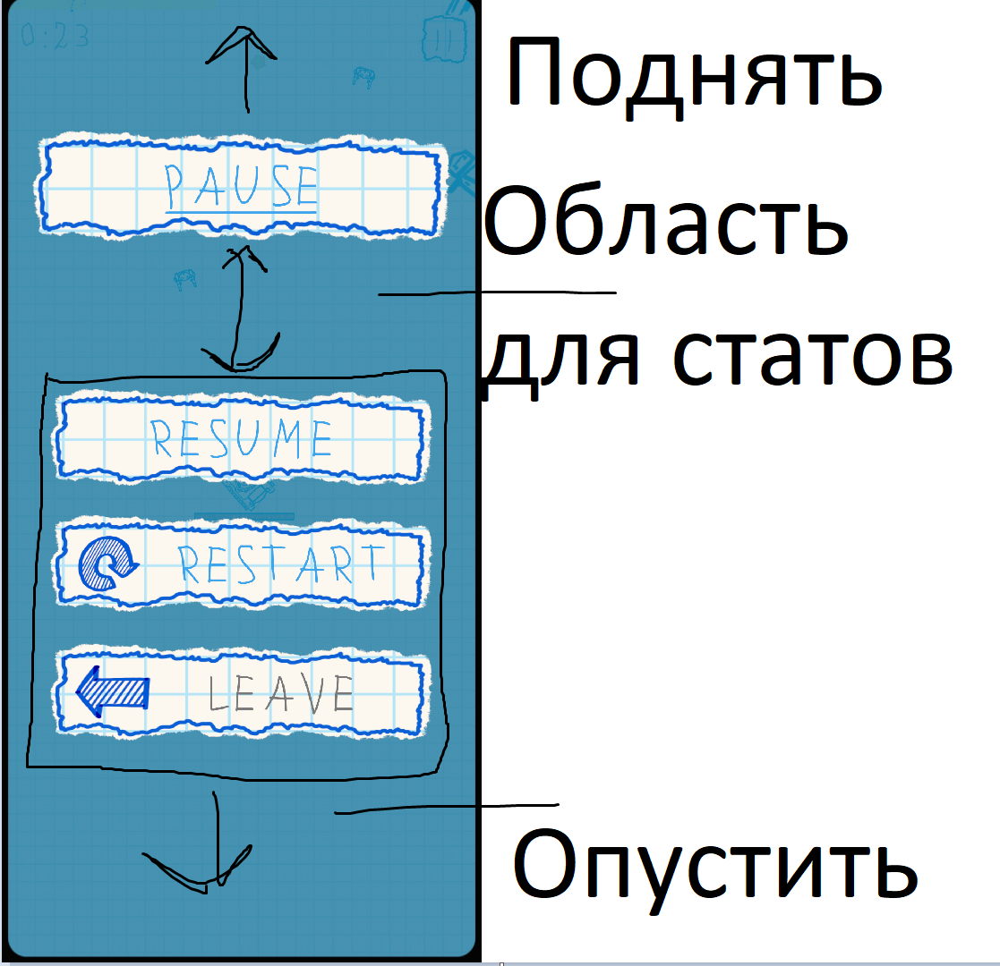

- Танк не стреляет если врага нет в радиусе – надо чтобы стрелял.
- Камеру отдаления на 10 поставить.
- Увеличить расстояние между апгрейдами.

- Надо добавить задержку после взятия апдейта - надо тестить по ощущениям, но 3 секунды это база.
- Добавить числовое обохзночения при поднятии пик-апа. взял здоровье -> в месте взятия появляется текст "+25" (зеленыйм цветом, затухает 2 секунды). Тоже самое для опыта.
- Босс не опредеялется как враг.
- Поиск врагов не работает на башни - только на basic gun.
- Надо вынести статы танка в меню паузы.

- Скейл танка поставить на 1.25 по всем координатам.
- Скейл солдата поставить на 1.25 по всем координатам.
- В меню апгрейда сделать отображение как апгрейд повляет на текущие статы - 10 урона было -> +10% общий урон -> 11 урона будет - отмена
-
-
-
-
-
-
-
-
-
-
-
-
-
-
-
-
-
-
-
-
-
-
-
-
-
-
-
-
-
-
-
